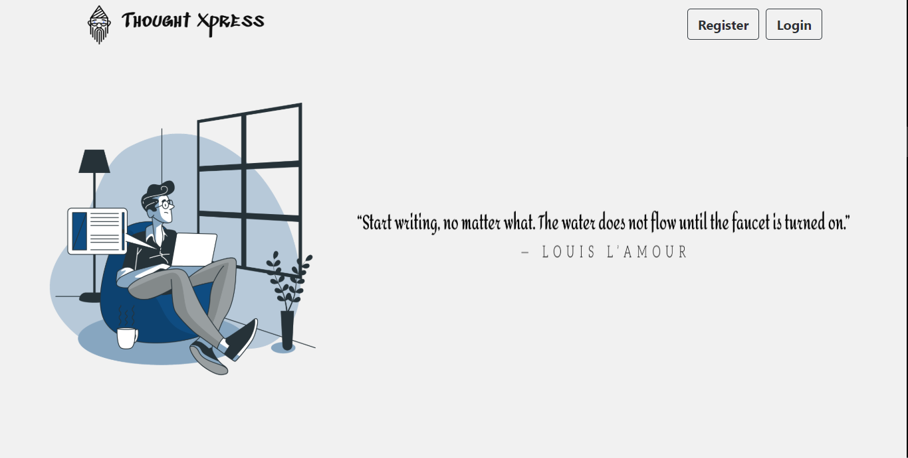
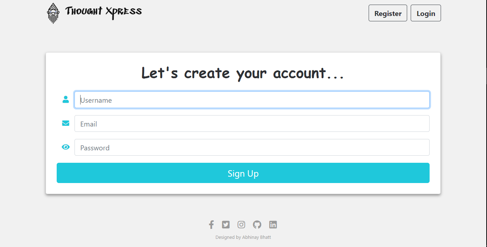
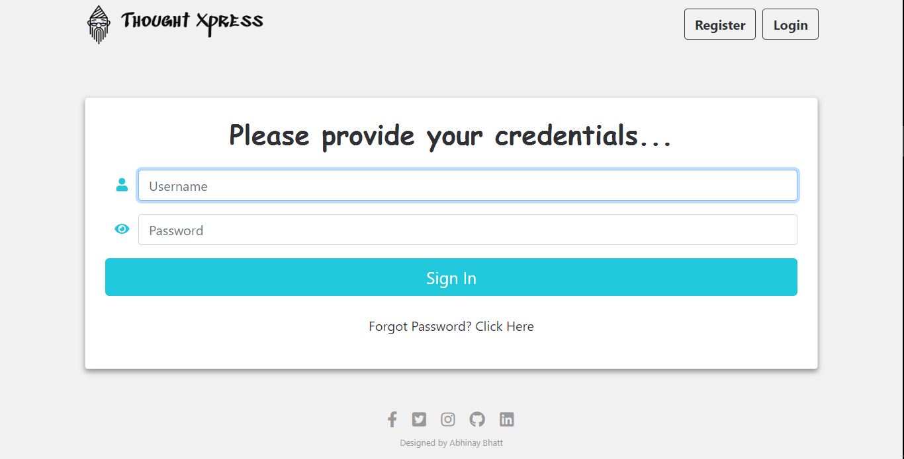
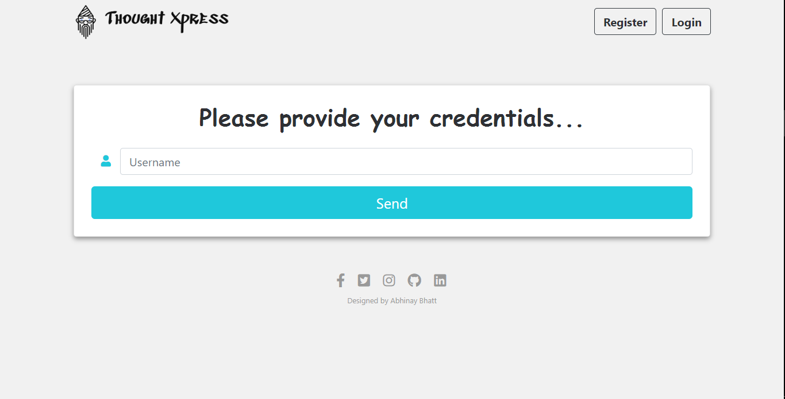
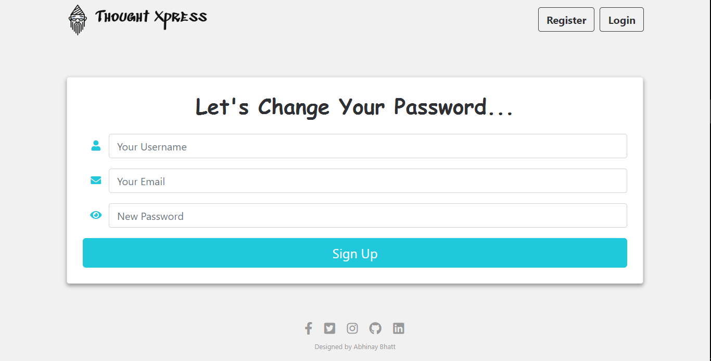
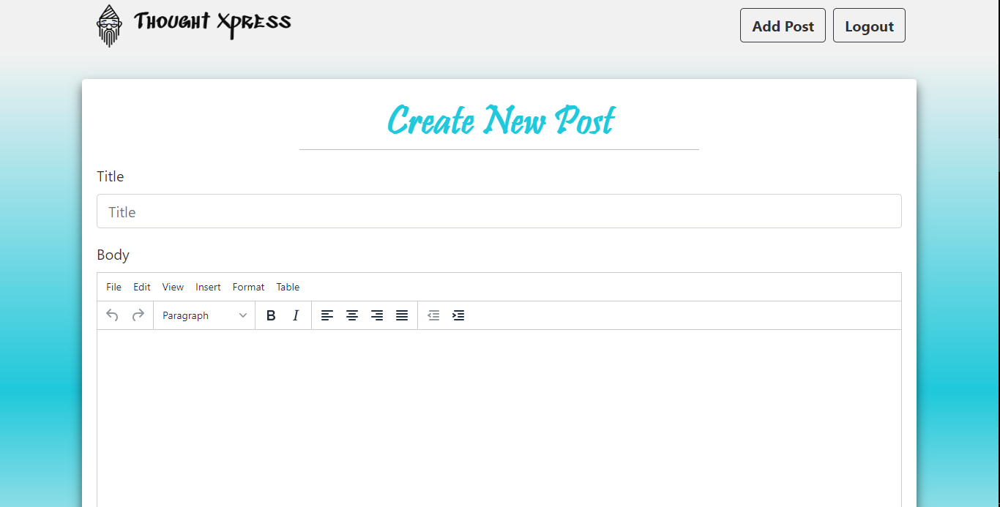

# Thought Xpress
A blogging website built using Angular and Spring.

> ## [Live Website Link](https://ng-spring-blog-frontend.herokuapp.com)

## Technologies
* Angular 9
* Node.js
* Express.js
* Bootstrap 4
* Spring Technologies
    - Spring Boot
    - Spring Security
    - Spring Data JPA
* Mysql
* Postman
* Heroku

## Functional Description

> ### Welcome Page

By default you will land on this page when you access the website.

> ### Register Page

* **Dynamic validation** on each field.
* All fields are required.
* Userame should be **unique**. If it is not unique, you will be asked to choose some other username.
* Email validation ensures email in proper format.
* Password validation ensures the following conditions:
    - minimum 8 characters
    - an uppercase letter
    - a lower case letter
    - a number
    - a special character
* Using the icon of 'eye' near the 'password' text field, users can *toggle the password visibility*.
* Password is encrypted before getting stored into database using BCrypt hashing algorithm
* Password encoder interface by spring security is used.
* Automatic redirect on successful registration.

> ### Login Page

* **Dynamic validation** on each field.
* All fields are required.
* Using the icon of 'eye' near the 'password' text field, users can *toggle the password visibility*.
* JWT (JSON Web Tokens) used for login because they can statelessly handle the user authentication by just generating the token and use this token at the time of request to identify user on server.
* Java Key Store is used which provides public and private keys. Private key is used to sign the token and public key is used to validate the token.
* Username and token is stored in local storage of browser.
* If user click on forgot password link, he will be redirected to forgot password page.

> ### Forgot Password Page

* **Dynamic validation** on username field and it is required.
* When a user clicks on the send button, an email will be sent to the user's registered email id, which contains a link to a page where user can change his password.
* Registered email id will be automatically fetched from user repository using the username entered by the user. This will ensure security.
* On clicking on the link sent on email user will be directed to a page where he can change the password.

> ### Change Password Page

* **Dynamic validation** on each field.
* All fields are required.
* Userame should be same as mentioned in the email.
* Email validation ensures email in proper format.
* Password validation ensures the following conditions:
    - minimum 8 characters
    - an uppercase letter
    - a lower case letter
    - a number
    - a special character
* Using the icon of 'eye' near the 'password' text field, users can *toggle the password visibility*.
* Password is encrypted before getting stored into database using BCrypt hashing algorithm
* Password encoder interface by spring security is used.
* Automatic redirect on successful registration.

> ### Home Page

* All the post by various authors are displayed on the home page.
* Latest posts are dislayed first.
* A search bar is given using which users can search the posts of a particular author by entering his username.
* As the user enters some characters in the search bar, posts changes dynamicaly and only those posts are visible whose author name contains the entered characters.
* 'Add Post' button redirects users to a page where users can create a post.
* When user click on 'Logout' button, token and username is deleted from local storage.
* By clicking on 'Read More' button present on every post, users will be redirected to a page where they can view the full post.

> ### Post Page

* By clicking on 'Home' button, users will be redirected to home page.
* By using 'Delete' button, user can delete a post *if and only if he is the author of the post.*
* **'Delete' button is visible on the page only if author of the post is viewing the page.**

> ### Add Post Page

* This page if for creating new post.
* Title is mandatory.
* A text editor is provided which includes various text and image formatting options.
* By clicking on 'Post' button, post will be added to the database and user will be redirected to home page where they can view their post.

> ### Some Other Features
* AuthGuard are implemented to check if user is permitted to visit a particular route.
* CORS (Cross Origin Resource Sharing) is enabled
* Http client interceptor is created to add the jwt to the authorization header.
* On logout, users will be redirected to welcome page.
* By clicking on back button of browser, if you are logged in, you will be directed to home page. Else will be directed to welcome page.
* Users can only post when they are logged in.
* By clicking on website's logo, user will be redirected to home page if logged in, else will be redirected to welcome page.
* All requests going to /api/auth are allowed (permitted) - the user does not have to authenticate.
* Any other request needs the user to be authenticated first, i.e. the user needs to login.
* Password is encrypted before storing using BCrypt hashing algorithm.
* Java Key Store is used which provides public and private keys. Private key is used to sign the token and public key is used to validate the token.
* Postman is used for testing endpoints.

> ### Database
* Mysql is used as a database which is deployed on an instance on Alibaba cloud.
* All interactions with database are done using Spring Data JPA.
* Two tables are created (User and Post).
* User table stores the data related to users that they enter during registration process.
* Post table stores the posts created by the users along with the date and time of creation.
* Proper primary keys and foreign keys are used for maintaining an efficient relationship among the entities.